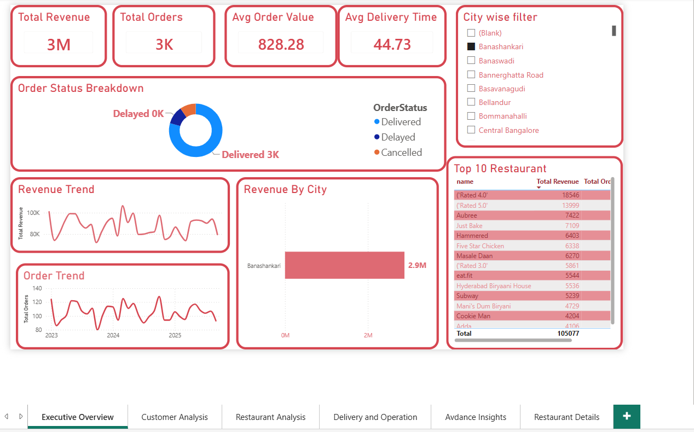
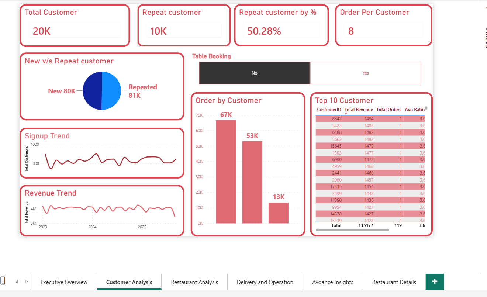
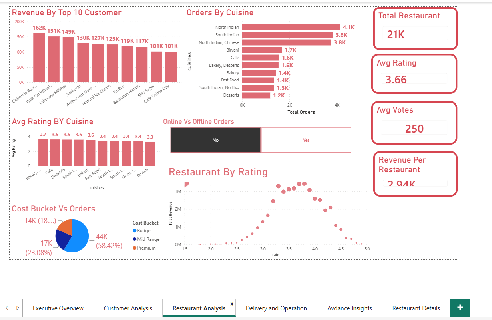
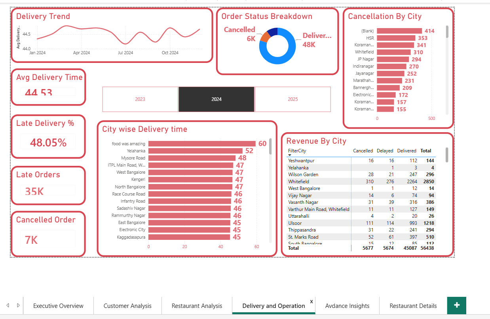
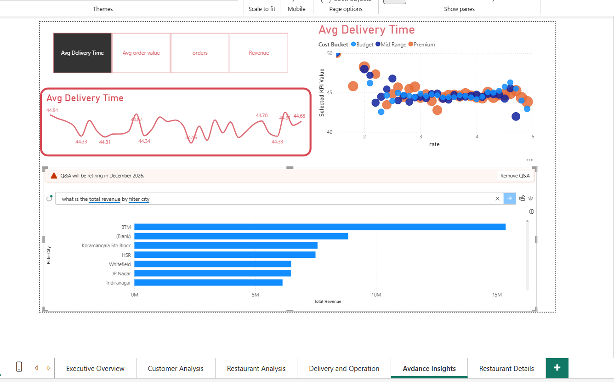
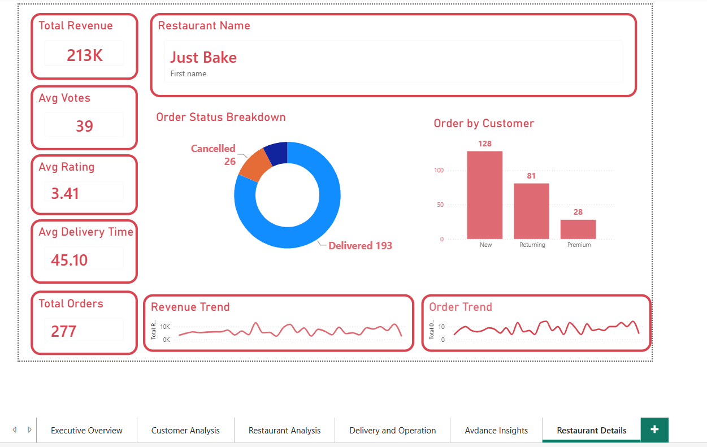

# Food-Delivery-App-Analysis-Using-Power-BI-&-Excel

(1) Project Description

This project presents an interactive Food Delivery Analytics Dashboard built using Power BI. It analyzes key business metrics such as revenue, customer behavior, restaurant performance, delivery operations, and advanced insights to support data-driven decision-making. The dashboard enables stakeholders to monitor overall business performance through interactive filters, KPIs, and visualizations.

(2) Features Highlights
        (a)📊 Executive Overview with business KPIs (Revenue, Orders, Average Order Value, Delivery Time)
        (b)👥 Customer Analysis including repeat customers, customer segmentation, and signup trends
        (c)🍽️ Restaurant Performance Analysis by revenue, ratings, cuisine, and votes
        (d)🚚 Delivery & Operations Analysis with delivery trends, cancellation analysis, and city-wise delivery performance
        (e)📈 Advanced Insights using Power BI Q&A and interactive visualizations
        (f)🏪 Restaurant Details page with individual restaurant performance metrics
        (g)🎛️ Interactive slicers and filters for dynamic data exploration
        (h)📅 Time-based trend analysis for revenue, orders, and delivery performance
        
(3) Tech Stack
        (a)Power BI Desktop
        (b)Power Query (Data Cleaning & Transformation)
        (c)DAX (Data Analysis Expressions)
        (d)Microsoft Excel
        (e)Data Modeling

(4) Data Source
        (a)Dataset: Food Delivery Dataset
        (b)Source: Kaggle
        (c)Format: Microsoft Excel (.xlsx)

(5)Dashboard Preview:
1. Executive Overview
The Executive Overview dashboard provides a high-level summary of business performance through key performance indicators, revenue trends, order trends, city-wise revenue analysis, and top-performing restaurants.

Key Insights: Total Revenue , Total Orders ,Average Order Value ,Average Delivery Time ,Revenue Trend ,Order Trend ,Revenue by City ,Top 10 Restaurants

2. Customer Analysis
This dashboard analyzes customer behavior, including repeat customers, customer segmentation, signup trends, and revenue generated by different customer groups.
Key Insights
        -Total Customers
        -Repeat Customers
        -Repeat Customer Percentage
        -Orders per Customer
        -New vs Repeat Customers
        -Signup Trend
        -Revenue Trend
        -Top 10 Customers

3. Restaurant Analysis
This dashboard evaluates restaurant performance based on revenue, customer ratings, cuisines, and customer votes.
Key Insights
        -Total Restaurants
        -Revenue by Top Restaurants
        -Orders by Cuisine
        -Average Rating by Cuisine
        -Revenue by Restaurant Rating
        -Cost Bucket Distribution
        -Revenue per Restaurant

4. Delivery & Operations
This dashboard focuses on operational performance by monitoring delivery efficiency and cancellation patterns.
Key Insights
        -Average Delivery Time
        -Late Delivery Percentage
        -Late Orders
        -Cancelled Orders
        -Delivery Trend
        -Order Status Breakdown
        -Cancellation by City
        -City-wise Delivery Performance

5. Advanced Insights
This page demonstrates advanced Power BI capabilities using interactive visuals and Q&A to explore business questions dynamically.
Key Insights
        -Interactive Q&A Visual
        -Revenue Analysis
        -Delivery Time vs Rating
        -Cost Bucket Analysis
        -Dynamic Business Queries

6. Restaurant Details
This dashboard provides a detailed performance overview of an individual restaurant, allowing users to evaluate operational and financial metrics for a selected restaurant.
Key Insights
        -Restaurant Revenue
        -Average Rating
        -Average Votes
        -Average Delivery Time
        -Order Status Breakdown
        -Customer Order Distribution
        -Revenue Trend
        -Order Trend

